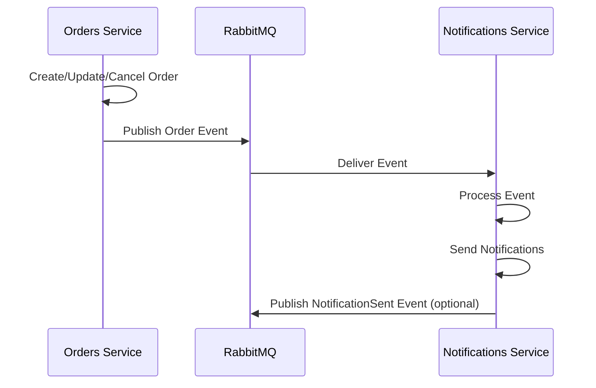

# Domain Models and Events

## Orders Domain

### Order Entity
```csharp
public class Order
{
    public Guid Id { get; set; }
    public string OrderNumber { get; set; }
    public Guid CustomerId { get; set; }
    public DateTime OrderDate { get; set; }
    public OrderStatus Status { get; set; }
    public decimal TotalAmount { get; set; }
    public List<OrderItem> Items { get; set; } = new();
    public DateTime CreatedAt { get; set; }
    public DateTime? UpdatedAt { get; set; }
}

public enum OrderStatus
{
    Pending,
    Confirmed,
    Processing,
    Shipped,
    Delivered,
    Cancelled
}

public class OrderItem
{
    public Guid Id { get; set; }
    public Guid OrderId { get; set; }
    public Guid ProductId { get; set; }
    public string ProductName { get; set; }
    public int Quantity { get; set; }
    public decimal UnitPrice { get; set; }
    public decimal TotalPrice { get; set; }
}
```

### Order Events
```csharp
public class OrderCreatedEvent
{
    public Guid OrderId { get; set; }
    public string OrderNumber { get; set; }
    public Guid CustomerId { get; set; }
    public decimal TotalAmount { get; set; }
    public DateTime CreatedAt { get; set; }
}

public class OrderUpdatedEvent
{
    public Guid OrderId { get; set; }
    public OrderStatus OldStatus { get; set; }
    public OrderStatus NewStatus { get; set; }
    public DateTime UpdatedAt { get; set; }
}

public class OrderCancelledEvent
{
    public Guid OrderId { get; set; }
    public string Reason { get; set; }
    public DateTime CancelledAt { get; set; }
}
```

## Notifications Domain

### Notification Entity
```csharp
public class Notification
{
    public Guid Id { get; set; }
    public Guid UserId { get; set; }
    public NotificationType Type { get; set; }
    public string Title { get; set; }
    public string Message { get; set; }
    public bool IsRead { get; set; }
    public DateTime CreatedAt { get; set; }
    public NotificationChannel Channel { get; set; }
}

public enum NotificationType
{
    OrderCreated,
    OrderUpdated,
    OrderCancelled,
    OrderShipped,
    OrderDelivered
}

public enum NotificationChannel
{
    Email,
    InApp,
    Push
}
```

### Notification Events
```csharp
public class NotificationSentEvent
{
    public Guid NotificationId { get; set; }
    public Guid UserId { get; set; }
    public NotificationType Type { get; set; }
    public NotificationChannel Channel { get; set; }
    public DateTime SentAt { get; set; }
}
```

## Event Flow Diagram



## Database Schema (SQL Server)

### Orders Table
```sql
CREATE TABLE Orders (
    Id UNIQUEIDENTIFIER PRIMARY KEY,
    OrderNumber NVARCHAR(50) NOT NULL,
    CustomerId UNIQUEIDENTIFIER NOT NULL,
    OrderDate DATETIME2 NOT NULL,
    Status INT NOT NULL,
    TotalAmount DECIMAL(18,2) NOT NULL,
    CreatedAt DATETIME2 NOT NULL,
    UpdatedAt DATETIME2 NULL
);

CREATE TABLE OrderItems (
    Id UNIQUEIDENTIFIER PRIMARY KEY,
    OrderId UNIQUEIDENTIFIER NOT NULL,
    ProductId UNIQUEIDENTIFIER NOT NULL,
    ProductName NVARCHAR(255) NOT NULL,
    Quantity INT NOT NULL,
    UnitPrice DECIMAL(18,2) NOT NULL,
    TotalPrice DECIMAL(18,2) NOT NULL,
    FOREIGN KEY (OrderId) REFERENCES Orders(Id)
);
```

### Notifications Table
```sql
CREATE TABLE Notifications (
    Id UNIQUEIDENTIFIER PRIMARY KEY,
    UserId UNIQUEIDENTIFIER NOT NULL,
    Type INT NOT NULL,
    Title NVARCHAR(255) NOT NULL,
    Message NVARCHAR(MAX) NOT NULL,
    IsRead BIT NOT NULL DEFAULT 0,
    CreatedAt DATETIME2 NOT NULL,
    Channel INT NOT NULL
);
```

## Future MongoDB Compatibility
The domain models are designed to be easily migratable to MongoDB by:
- Using Guid for IDs (compatible with ObjectId)
- Keeping entities as document-friendly structures
- Avoiding complex joins that would be expensive in MongoDB