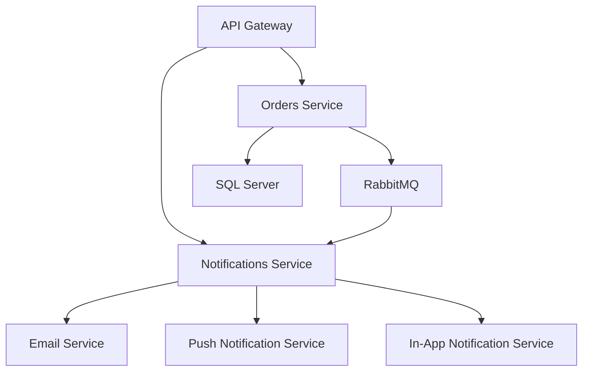

# Procurement Microservices Architecture

## Overview
This document outlines the architecture for a Procurement system built with event-driven microservices. The initial implementation includes Orders and Notifications microservices, with plans for future expansion.

## Technology Stack
- **Framework**: .NET Core
- **Database**: SQL Server (with future MongoDB compatibility)
- **ORM**: Entity Framework Core
- **Event Streaming**: RabbitMQ
- **Communication**: gRPC and REST APIs
- **Containerization**: Docker
- **Orchestration**: Kubernetes
- **API Gateway**: To be determined (e.g., Ocelot or similar)

## System Architecture

## Microservices

### Orders Microservice
- **Responsibilities**:
  - Manage order lifecycle (create, update, cancel, retrieve)
  - Publish order events to RabbitMQ
  - Expose REST and gRPC APIs
- **Database**: SQL Server with EF Core
- **Events Published**:
  - OrderCreated
  - OrderUpdated
  - OrderCancelled

### Notifications Microservice
- **Responsibilities**:
  - Listen for order events from RabbitMQ
  - Send notifications via email, in-app, and push
  - Manage notification preferences
- **Events Consumed**:
  - OrderCreated
  - OrderUpdated
  - OrderCancelled

## Event Flow
1. User creates order via API Gateway → Orders Service
2. Orders Service saves to database and publishes OrderCreated event
3. Notifications Service consumes event and sends appropriate notifications

## Deployment
- Each microservice will have its own Dockerfile
- Kubernetes manifests for deployment and scaling
- API Gateway for external access and load balancing

## Future Considerations
- Service discovery (Consul/Eureka)
- Centralized configuration management
- Monitoring and logging (ELK stack)
- Authentication/Authorization (JWT/OAuth)
- Database migration to MongoDB
- Additional microservices (Inventory, Payments, etc.)